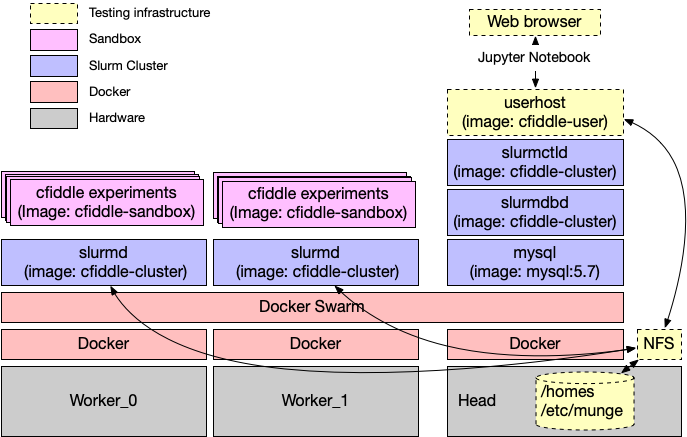

# A Containerized CFiddle Cluster Deployment

This repo describes/embodies how to deploy a cluster of machines for
use with CFiddle so that multiple users (e.g., students) can share
access to the machines while ensuring that their cfiddle experiments
run alone on the machine so their measurements are accurate.  It also
ensures that the users can't mess up the machines or interfere with
eachother's jobs.

The approach it takes it to use the [Slurm job
scheduler](https://slurm.schedmd.com/documentation.html) to schedule
the execution of the cfiddle experiments.  It makes extensive use of
Docker containers and Docker's Swarm and Stack facilities.

There are many other ways to accomplish the same goal.  The approach
here is meant to be simplest, although it is not the most elegant.  It
is the one the author is currently using in production.

The last section of the document describes other configurations that
might be desirable in your situation.

## What This Repo Builds



The instructions and code in this repo will let you assemble the following:

1.  A group of _worker nodes_ to run cfiddle jobs
2.  A _head node_ to coordinate access to the cluster.
3.  An appropriate configuration for cfiddle so it'll run jobs on the cluster.
4.  A exampler _user node_ that is not part of the slurm cluster but serves Jupyter Notebooks that can submit cfiddle jobs to the cluster.
5.  Three docker images:
    * One for the head node and worker nodes (`cfiddle-cluster')
    * One for the user node (`cfiddle-user`)
    * A sandbox docker image to run the user's code (`cfiddle-sandbox`)
6.  A couple test user accounts to show that everything works (`test_cfiddle.py`)

We will assume that the cluster is dedicated to running CFiddle jobs
and nothing else.

### Theory of Operation


We will configure CFiddle so that when the user's CFiddle code
(running on the "user node") requests execution of an experiment,
CFiddle will use the facilities provided by `delegate_function` to run
the code someplace other than the local machine.

That "someplace" will be one in single-use "sandbox" docker container
running on one of the worker nodes in our Slurm cluster.
`delegate_function` will accomplish this by submitting a Slurm job to
the cluster.  That job will then spawn the sandbox container on the
worker node.

The user node and the worker nodes will all share a single `/home/`
directory so the users files are available to their job running on the
slurm cluster.

How, exactly, `delegate_function` bundles up the CFiddle code and its
inputs and then collects its outputs is outside the scope of this
document.  But you can read about it in the `delegate_funciton` source
code.

### What We Provide and What You Need to Provide

The implementation embodied in this git repo is meant to make it easy
as possible to set up a CFiddle cluster, so most the implementation
this document describes is suitable for use in deployment (although
you need to customize some configurations files).

However, there are a few places that you will need to customize:

1.  The shared file storage
2.  The user image
3.  The sand box image (maybe)

For shared user directories, the instruction below set up a simple NFS
server, which will work fine for simple, stand-alone installations,
but if you want to integrate with an existing system, it'll take some
tweaking.

The user image is a standin for whatever environment your users will
be using.  The version provide is based on the standard jupyter
notebook image but adds what's necessary to make slurm work.

The sand box image just includes `cfiddle` and `delegate_function`, so
it should be sufficient for running standard `cfiddle` experiments.
If you're doing any think fancy with `cfiddle` you'll need to modify
the the sand box to matches what's in the user's environment.

You will also need an account on [dockerhub.com] and you'll need to
know your username.

### Implementation Roadmap

This deployment is fully containerized so that we don't have to
install anything other than `git` (to clone this repo) and `docker` on
machines to get things working.

We will build this system in layers.

First, we will acquire a head node and set of worker nodes and install
docker on them.

Second, we will create a docker swarm from those nodes to facilitate
their management.

Third, we will instantiate a set of docker "services" using docker
"stacks".  This will start several containers on the head node to run
Slurm and a container on each worker node.

Fourth, we will test the cluster by running some cfiddle experiments
from the user node.

## What this Repo Does not Build

This repo is not a great resource for deploying a general purpose
Slurm cluster.

It is also not instructions for using an existing Slurm cluster to run
Cfiddle jobs.  This certainly possible and the tools support it.  If
you have a suitable Slurm cluster available, it's probably easier to
go that route.

## But I Want to Do Something Slightly Different

That's great!  This repo probably provides helpful hints.

Also, the maintainers are excited to help people use CFiddle, so
please email sjswanson@ucsd.edu if you have questions or need help.

##  What You Will Need

### Hardware

You will need at least two machines: One worker node and one head node.

The head node can pretty much any server (or virtual machine) that
runs a recent version of Docker.  You'll need root access to
it.

The worker machines are where the CFiddle experiments will run.  They
should be dedicated to this task and not be running anything else.

For testing this guide, we used bare metal cloud servers from
https://deploy.equinix.com/.  Any x86 instance type will do for
testing.  Pick something cheap.

You need to be familiar with how provision servers, install the OS,
and be able to ssh into them.

### Software

We built this guide with the following software:

1. Ubuntu 22.04 (the `ubuntu:jammy` docker image)
2. Docker version 24.0.5
3. The latest version of `cfiddle`
4. The latest version of `delegate_function`
5. Python 3.10
6. The `jupyter/scipy-notebook:python-3.10` image.

In principle, the version of Linux shouldn't matter much, but some of
the scripts will probably need to be adjusted.

We are using some newish docker features.  In particular, we need
docker-compose.yml 3.8 (which requires at least Docker 19.03), and we
use `CAP_PERFMON` which was broken in docker until recently.  It works
in the version listed above, but I'm not sure when it started working

The versions of python _on all the images_ must match, since
`delegate_function` runs everywhere.  Changing to a different version
is complicated.  I chose 3.10 because it's what got installed under
`ubuntu:jammy`.  Then I selected the matching jupyter image to match.

### Docker.com Account

You'll need an account on docker.com, and you'll need to be logged in
before you run the script to build the cluster. You can do that with:

```
docker login -u $DOCKERHUB_USERNAME
```

Be sure to do this!  Otherwise, the build script will fail part way through.

## The Actual Implementation

The actual implementation for all of this is in `build_cluster.sh`.
It's a heavily commented shell script that actually builds and tests
the cluster.  _You will need to read the comments for the first steps to do the initial setup_.

You can build the cluster with:

```
./build_cluster.sh
```

## Testing

Once `build_cluster.sh` runs successfully, you can test basic slurm functions with

```
. config.sh
./test_cluster.sh
```

Which will show you a live-updating view of the job queue.  When it's
empty (or you get board), Control-C to quit, and then `exit` to get
out of the user node container.

To make sure cfiddle is working:

```
. config.sh
docker exec -it $userhost pytest -s test_cfiddle.py
```

## Step 10: Access Jupyter

Jupyter should also now be running on the usernode container.  You should be able to access it at:

```
http://$HEAD_ADDR:8888/lab?token=slurmify
```

Navigate to somewhere and run a cfiddle command...

## Changing the Cluster

Once the cluster is running, you can rebuild the images and restart the cluster with

```
update_cluster.sh
. config.sh
```

You will need to re-source `config.sh` to reload some environment variables.


## Alternative Configurations

The system we just built has some draw backs:

1. The proxy container mechanism means that the Slurm cluster is not suitable for general use.
2. All the CFiddle jobs run as the same user -- `cfiddle`.

These decisions are both driven by the desire for simplicity.  In
particular, proxy containers avoid the need maintain user accounts or
directories across the worker nodes.

A more elegant installation, would keep user accounts synchronized
across the head node and the workers, provide unified home directories
across the machines, and then use the worker nodes themselves be
members of the Slurm cluster.

## Possibly useful

https://github.com/nateGeorge/slurm_gpu_ubuntu

## Munge Key

Grab the munge uid and group we will use, and build the munge use and group

```
. config.sh
groupadd munge -g $MUNGE_GID
useradd munge -u $MUNGE_UID -g $MUNGE_GID
```

Install `munge` which will generate `/etc/munge/munge.key` as a side effect.

```
apt-get install -y munge 
```

Later, if you need to change, it 

```
mungekey
chown munge:munge /etc/munge/munge.key
```

## Notes

### Where To Get Servers

For testing we use [Equinix Metal](https://deploy.equinix.com/).
Their `c3.small.x86` instances are reasonably cheap ($0.75/hour) and
work well.  They are not available in all zones, so you might have to
hunt for them when provisioning machines.

AWS has bare metal servers but they are huge (e.g., 100s
of cores) and very expensive.

For courses we use a cluster of 12 small Intel blade servers provided
by our institution.  We used to use Equinix for courses too, but it is a bit pricey.

### How Many Servers Do You Need?

We have typically have ~215 students and at peak times (e.g., right
before a homework is due), the 12 servers are saturated.

When we were using Equinix, we would manually scale up the cluster
size when load spiked.  The problem is that Equinix sometimes runs out
of a particular instance type, which can be a problem because results
need to match across machines.  We just told students to work early
and hoped instances were available.


### 

